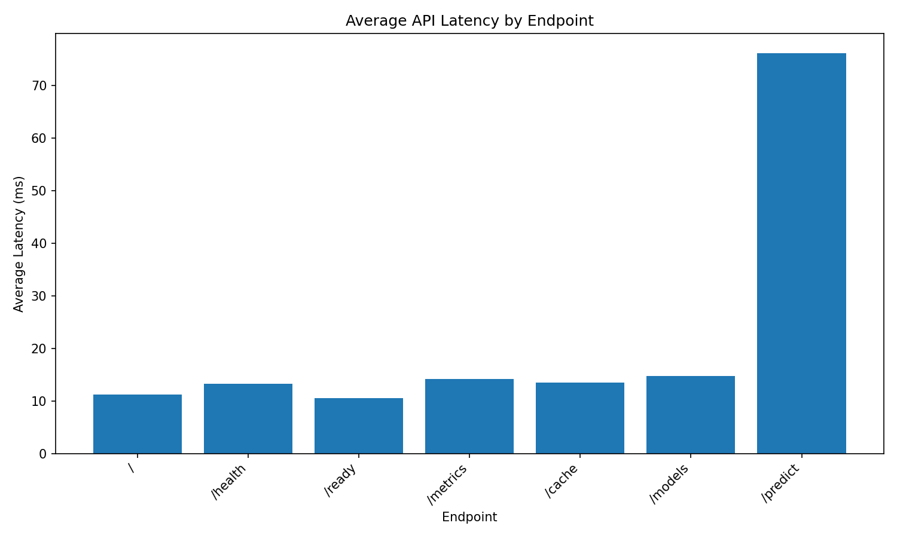
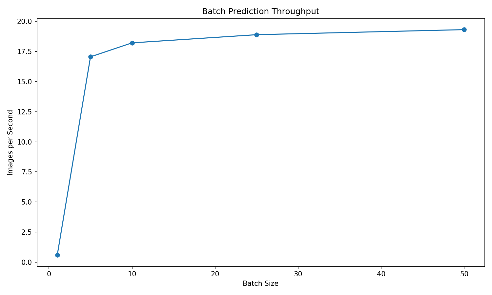
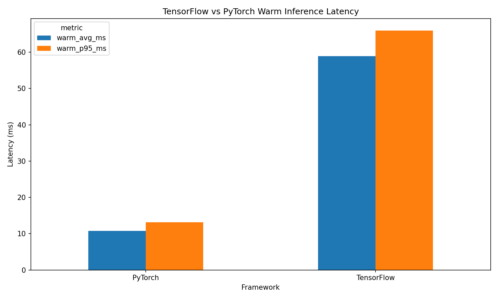
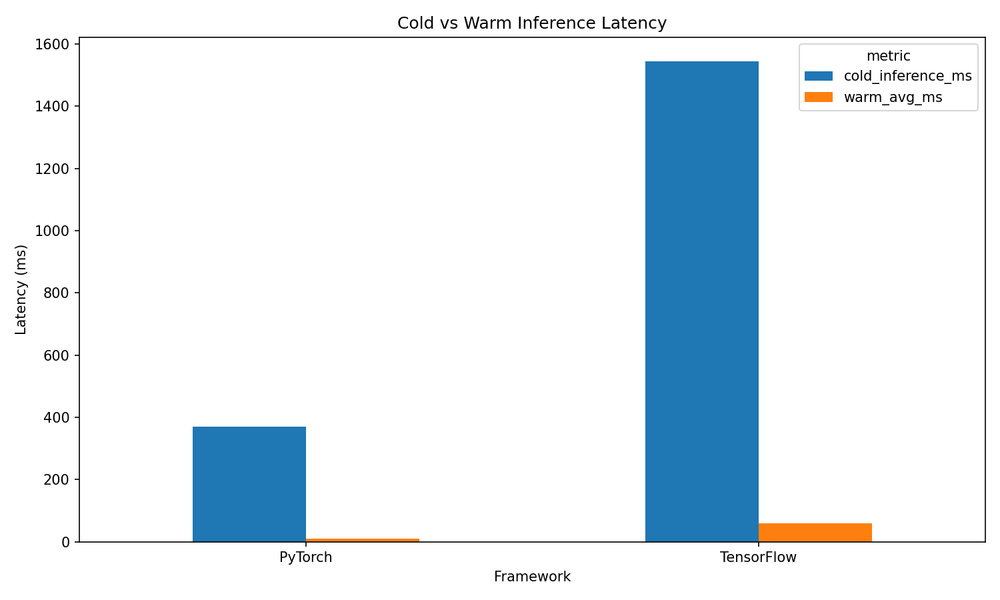

# Performance Benchmark Report

---

## Executive Summary

The Industrial Defect Detection platform was benchmarked to establish
a repeatable performance baseline for API responsiveness, model
inference latency, and batch prediction throughput.

The results in this report provide a reference for future optimization,
capacity planning, and performance regression testing.

### Key Findings

- Management endpoints responded with consistently low latency.
- Single-image prediction averaged approximately **76.1 ms**.
- TensorFlow warm inference averaged approximately **58.94 ms**.
- PyTorch warm inference averaged approximately **10.81 ms**.
- Batch throughput improved as batch size increased.
- Warm inference significantly outperformed cold inference.

---

## Test Environment

| Property | Value |
|---|---|
| Generated At | 2026-07-06T19:20:57.829077+00:00 |
| Platform | Windows-10-10.0.26200-SP0 |
| Python Version | 3.11.9 |
| TensorFlow Version | 2.16.1 |
| PyTorch Version | 2.3.1+cpu |
| FastAPI Version | 0.115.0 |
| Processor | Intel64 Family 6 Model 198 Stepping 2, GenuineIntel |
| Git Commit | d7e97ae |
| API Base URL | http://127.0.0.1:8000 |
| Framework | tensorflow |
| Category | bottle |
| Model Version | latest |
| Warm-up Requests | 3 |
| Benchmark Requests | 20 |

---

## Benchmark Methodology

The benchmark suite was executed using a controlled local testing
approach. The objective was to establish a repeatable baseline for
API, batch, and model inference performance.

- Warm-up requests were executed before measurement.
- Latency was measured using Python's high-resolution `time.perf_counter()`.
- Results include average, median, standard deviation, minimum, maximum, P50, P95, and P99 latency.
- API benchmarks measured FastAPI endpoint response times.
- Batch benchmarks measured throughput across multiple batch sizes.
- Model benchmarks compared cold and warm inference behavior.
- Benchmark outputs were exported as CSV files and summarized in this report.

---

## Performance Assessment

The table below provides a simple assessment of the measured
performance baseline. Thresholds are intended as project-level
guidance and should be refined as production SLOs are defined.

| Metric | Result | Assessment |
|---|---:|---|
| API prediction latency | 76.1 ms | Excellent |
| TensorFlow warm inference | 58.94 ms | Excellent |
| PyTorch warm inference | 10.81 ms | Excellent |
| Batch throughput | 19.32 images/sec | Good |

---

## API Performance



### Analysis

The benchmark results show that infrastructure endpoints such as
`/health`, `/ready`, `/metrics`, `/cache`, and `/models` responded
with low latency. These endpoints primarily validate application
state and metadata, so they introduce minimal processing overhead.

The `/predict` endpoint averaged approximately **76.1 ms**
because the request lifecycle includes file upload handling, image
preprocessing, model lookup, inference execution, and response
serialization.

### Measured API Performance

| endpoint   | method   |   avg_ms |   p95_ms |   p99_ms |   requests_per_second |
|:-----------|:---------|---------:|---------:|---------:|----------------------:|
| /          | GET      |    11.21 |    15.98 |    16.02 |                 89.18 |
| /health    | GET      |    13.31 |    15.91 |    27.29 |                 75.13 |
| /ready     | GET      |    10.58 |    22.7  |    26.35 |                 94.55 |
| /metrics   | GET      |    14.24 |    16.32 |    16.62 |                 70.25 |
| /cache     | GET      |    13.53 |    15.99 |    16.13 |                 73.9  |
| /models    | GET      |    14.74 |    16.3  |    16.41 |                 67.83 |
| /predict   | POST     |    76.1  |    85.7  |    86.49 |                 13.14 |

Detailed raw API benchmark results are retained in
`results/benchmarks/api_latency.csv` and
`results/benchmarks/api_raw_results.csv`.

---

## Batch Prediction Performance



### Analysis

Batch throughput increased from approximately **0.59
images/second** on the smallest batch to approximately
**19.32 images/second** at the highest measured throughput.
Request overhead, preprocessing overhead, and model execution overhead
are amortized across larger batches.

In production, the best batch size depends on latency requirements,
memory allocation, CPU allocation, and workload concurrency.

### Batch Results

|   batch_size | category   | framework   |   images_per_second |   latency_ms | model_version   |   status_code |
|-------------:|:-----------|:------------|--------------------:|-------------:|:----------------|--------------:|
|            1 | bottle     | tensorflow  |                0.59 |      1685.2  | latest          |           200 |
|            5 | bottle     | tensorflow  |               17.06 |       293.12 | latest          |           200 |
|           10 | bottle     | tensorflow  |               18.22 |       548.8  | latest          |           200 |
|           25 | bottle     | tensorflow  |               18.9  |      1322.81 | latest          |           200 |
|           50 | bottle     | tensorflow  |               19.32 |      2588.11 | latest          |           200 |

---

## Model Performance

### TensorFlow Model Performance

TensorFlow results include cold inference and warm inference. Cold
inference includes model loading and initialization effects, while
warm inference reflects repeated predictions after the model has
already been loaded and cached.

| category   | framework   | metric            | model_version   |   value |
|:-----------|:------------|:------------------|:----------------|--------:|
| bottle     | tensorflow  | cold_inference_ms | v1              | 1544.23 |
| bottle     | tensorflow  | warm_avg_ms       | v1              |   58.94 |
| bottle     | tensorflow  | warm_p95_ms       | v1              |   65.97 |

### PyTorch Model Performance

PyTorch results include cold inference and warm inference for the
ResNet18 pipeline. These measurements are specific to the model
architecture, hardware, software versions, and local runtime
configuration.

| category   | framework   | metric            | model_version   |   value |
|:-----------|:------------|:------------------|:----------------|--------:|
| bottle     | pytorch     | cold_inference_ms | v1              |  369.19 |
| bottle     | pytorch     | warm_avg_ms       | v1              |   10.81 |
| bottle     | pytorch     | warm_p95_ms       | v1              |   13.1  |

---

## Framework Comparison





### Comparison Table

| Metric | TensorFlow ms | PyTorch ms |
|---|---:|---:|
| Cold inference | 1544.23 | 369.19 |
| Warm average | 58.94 | 10.81 |
| Warm P95 | 65.97 | 13.1 |

### Analysis

In this benchmark environment, the PyTorch implementation produced
lower cold-start and warm inference latency than the TensorFlow
implementation.

These observations are specific to the evaluated models, preprocessing
pipeline, runtime configuration, and hardware platform, and should not
be interpreted as a general comparison between frameworks.

---

## Performance Baseline

The measurements presented in this report represent the baseline
performance for the current implementation. Future benchmark runs
should compare against these results to identify regressions,
validate optimizations, and support capacity planning.

---

## Recommendations

### Short-term

- Monitor P95 and P99 latency in production.
- Profile image preprocessing to reduce single-image prediction latency.
- Compare local benchmark results against Cloud Run execution.

### Medium-term

- Use Cloud Run minimum instances if cold-start latency becomes a concern.
- Tune Cloud Run CPU and memory allocation for inference-heavy workloads.
- Extend benchmarks across all MVTec AD categories.

### Long-term

- Add automated benchmark runs before major releases.
- Introduce load testing with concurrent users.
- Evaluate GPU-backed inference for higher-throughput workloads.

---

## Conclusions

The benchmark suite successfully established a repeatable baseline
for API latency, batch throughput, and model inference performance.

- API management endpoints consistently returned low-latency responses.
- Prediction latency is primarily driven by preprocessing and model inference.
- Batch prediction improved throughput at larger batch sizes.
- Warm inference substantially reduced latency compared with cold inference.
- The results provide a baseline for future performance optimization and regression testing.

---

## Limitations

- Benchmarks were executed in a local development environment.
- Synthetic sample images were used for lightweight benchmark execution.
- GPU acceleration was not evaluated.
- Production network latency was not fully measured.
- Results may vary depending on hardware, model cache state, and runtime configuration.

---

## Future Enhancements

- Cloud Run benchmark execution.
- Prometheus-compatible metrics.
- Google Cloud Monitoring dashboards.
- Load testing with concurrent users.
- GPU-backed inference benchmarks.
- Memory and CPU profiling.
- Automated performance regression checks in CI.
- Automatically publish benchmark reports as GitHub Actions artifacts.
- Compare benchmark results across Git commits to detect regressions.
- Portfolio-ready benchmark dashboard.

---

## Benchmark Metadata

| Property | Value |
|---|---|
| Git Commit | d7e97ae |
| Generated At | 2026-07-06T19:20:57.829077+00:00 |
| Environment | Local Development |
| Operating System | Windows-10-10.0.26200-SP0 |
| CPU | Intel64 Family 6 Model 198 Stepping 2, GenuineIntel |
| API Base URL | http://127.0.0.1:8000 |
| Framework | tensorflow |
| Category | bottle |
| Model Version | latest |

---

## Generated Artifacts

Benchmark outputs are stored in:

```text
results/benchmarks/
```

Expected artifacts include:

```text
docs/PERFORMANCE.md
api_latency.csv
api_raw_results.csv
batch_latency.csv
tensorflow_model_latency.csv
pytorch_model_latency.csv
benchmark_metadata.json
api_latency.png
api_latency.svg
batch_throughput.png
batch_throughput.svg
framework_comparison.png
framework_comparison.svg
cold_vs_warm.png
cold_vs_warm.svg
```